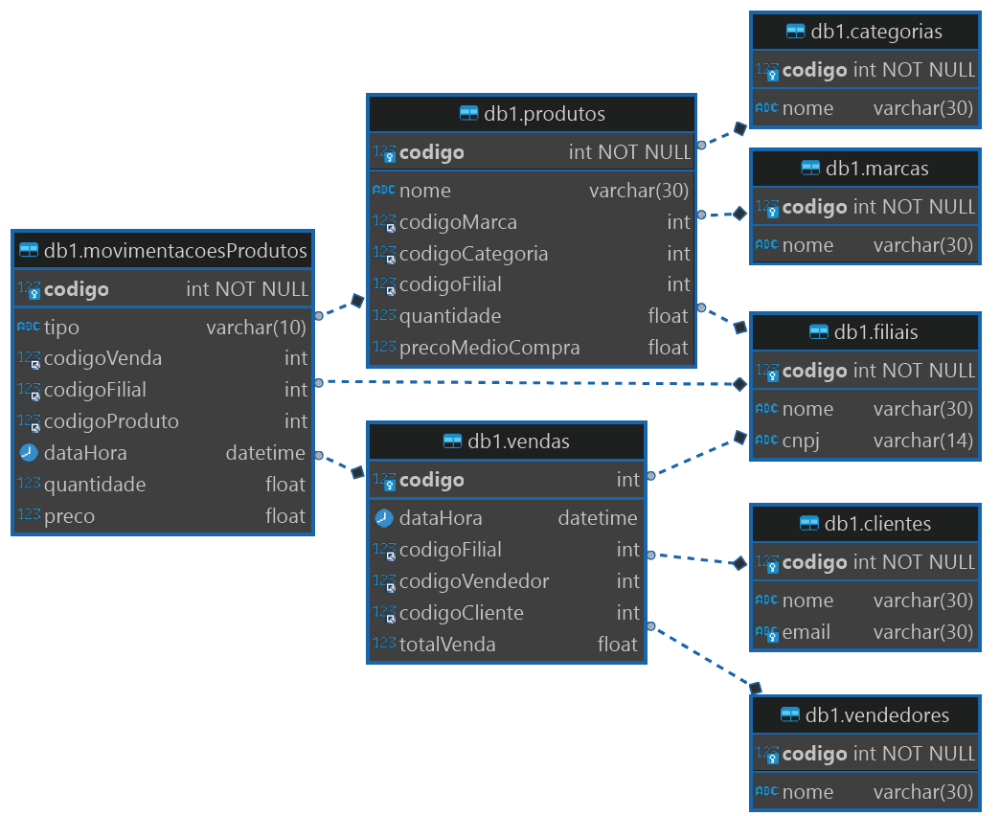

- [x] Modelar uma aplicação contendo entre 8 e 10 tabelas, disponibilize a imagem da modelagem e a estrutura SQL de criação da tabelas

  

- [x] Todas as tabelas devem possuir pelo menos dez registros;

- [ ] Implementar ao menos cinco views com inner join;
	- [ ] Necessário pelo menos dois inner joins contemplando duas tabelas;
	- [ ] Necessário pelo menos mais dois inner joins contemplando três
tabelas;
	- [ ] Necessário pelo menos um inner join contemplando cinco tabelas ou
mais.

- [ ] Criar uma view com Left Join;

- [ ] Criar uma view com Right Join;

- [ ] Implementar o uso de pelo menos duas triggers;

- [ ] Implementar o uso de pelo menos dez procedures:
	- [ ] Pelo menos três para realizar cadastros;
	- [ ] Pelo menos três para alterar;
	- [ ] Pelo menos três para remover.

- [ ] Todas as tabelas deverão disponibilizar comandos completos para: cadastrar,
alterar e remover dados;

- [ ] Criar comandos DQL contendo as seguintes expressões:
	- [ ] WHERE;
	- [ ] AND;
	- [ ] OR;
	- [ ] BETWEEN;
	- [ ] ORDER BY;
	- [ ] GROUP BY;
	- [ ] HAVING;
	- [ ] LIKE;
	- [ ] COUNT;
	- [ ] MAX;
	- [ ] MIN;
	- [ ] IF;
	- [ ] CASE;
	- [ ] NOW;
	- [ ] DATE_FORMAT;
	- [ ] Subqueries (utilização de dois comandos SQL na mesma query)